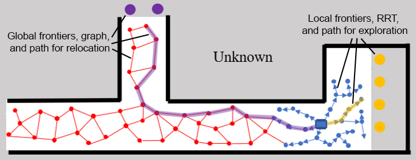

Dual-Stage Viewpoint Planner incorporates two planning stages in autonomous exploration - an exploration stage for extending the boundary of the map, and a relocation stage for explicitly transiting the robot to different sub-areas in the environment. The exploration stage develops Rapidly-exploring Random Tree (RRT) and dynamically expand the RRT over replanning steps. The relocation stage maintains a graph through the mapped environment. During the course of exploration, the method transitions back-and-forth between the two stages to explore all areas in the environment.\  

Please use instructions on our [project page](https://www.cmu-exploration.com/dsv-planner).

## Instructions ##
The repository has been tested in Ubuntu 18.04 with ROS Melodic and Ubuntu 20.04 with ROS Noetic. Follow instructions in [Autonomous Exploration Development Environment](cmu-exploration.com) to setup the development environment. Make sure to checkout the branch that matches the computer setup, compile, and download the simulation environments.
To setup DSV Planner, install dependencies with command lines below. Replace 'distribution' with 'melodic' or 'noetic' to match the computer setup.
sudo apt update
sudo apt install ros-distribution-octomap
### Clone and Compile ###
```bash
git clone https://github.com/HongbiaoZ/dsvplanner.git
```
In a terminal, go to the folder and checkout the correct branch. Replace 'distribution' with 'melodic' or 'noetic'. Then, compile.
```bash
cd dsv_planner
git checkout distribution
catkin_make
```
### Launch ###
To run the code, go to the development environment folder in a terminal, source the ROS workspace, and launch.
```bash
source devel/setup.sh
roslaunch vehicle_simulator system_garage.launch
```
In another terminal, go to the DSV Planner folder, source the ROS workspace, and launch.
```bash
source devel/setup.sh
roslaunch dsv_planner dsvp_garage.launch
```
Now, users should see autonomous exploration in action. To launch with a different environment, use the command lines below instead and replace 'environment' with one of the environment names in the development environment, i.e. 'campus', 'indoor', 'garage', 'tunnel', and 'forest'.
```bash
roslaunch vehicle_simulator system_environment.launch
roslaunch dsv_planner dsvp_environment.launch
```
### Who do I talk to? ###
Hongbiao Zhu (hongbiaz@andrew.cmu.edu)
